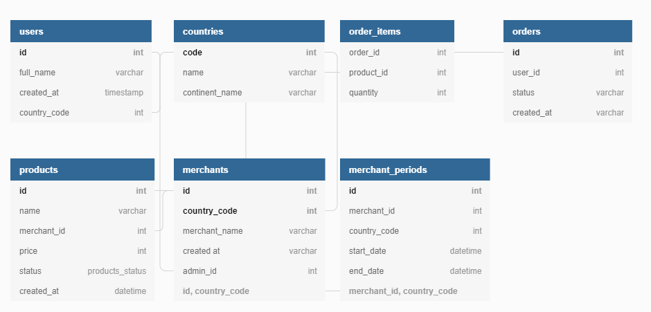

## Go "People" microservice

Used to retrieve the data about test persons in PSQL.

Stack:
- GO 1.17
- Gin
- GORM (https://gorm.io/docs/query.html)
- pgx (https://github.com/jackc/pgx)

DB diagram:
